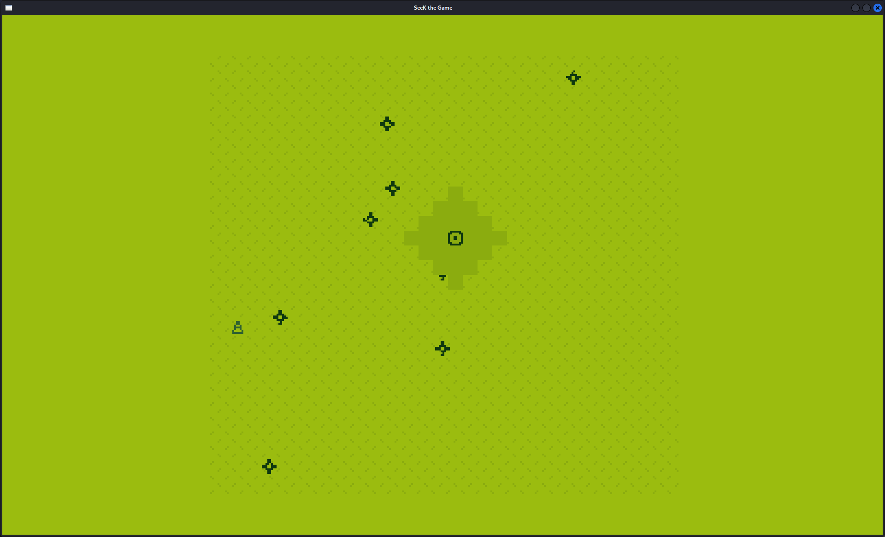

# SeeK the Game

NOTE: The newest commit comes after the assignment deadline. For grading, please look at the commit "harder enemies".

Author: Sirui Huang (siruih)

Design: People tend to omit the danger around them... Particularly in this game. You control an animatic eyeball to dodge spike balls and reach goals, although you surroundings will starts to get masked and you have to predict where to dodge.

Screen Shot:

How Your Asset Pipeline Works:
The asset pipeline read png images from ~/dist/assets and read them as patterns to draw with the ppu466. The filenames are 
read to determine which type of assets the files fall into. Below is the avatar you'll controll!

How To Play:
Control the eyeball with arrow keys and avoid the spike balls. Look for this:

Contacting it will ramp up the difficulty. With higher difficulty, your avatar will be masked with more shadowy region and
spike balls will move faster. 

This game was built with [NEST](NEST.md).

